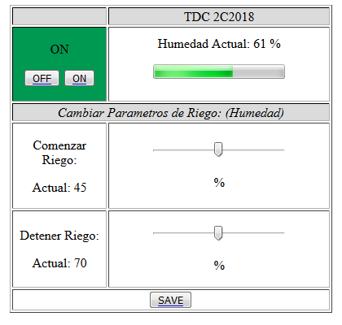

# TP_TDC18_ARDUINO_REGADOR
Es un proyecto realizado en Arduino UNO R3, para la materia Teoria de Control. El objetivo es controlar y automatizar un sistema de riego por Ethernet.

# Captura de Pantalla de la interfaz Web:

> Algunos links de interes (Simuladores/Ejemplos):

> https://www.arduino.cc/

> http://fritzing.org/home/

> https://www.tinkercad.com/circuits
